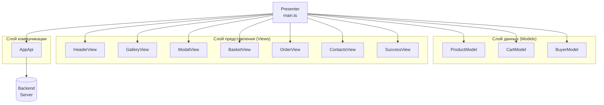
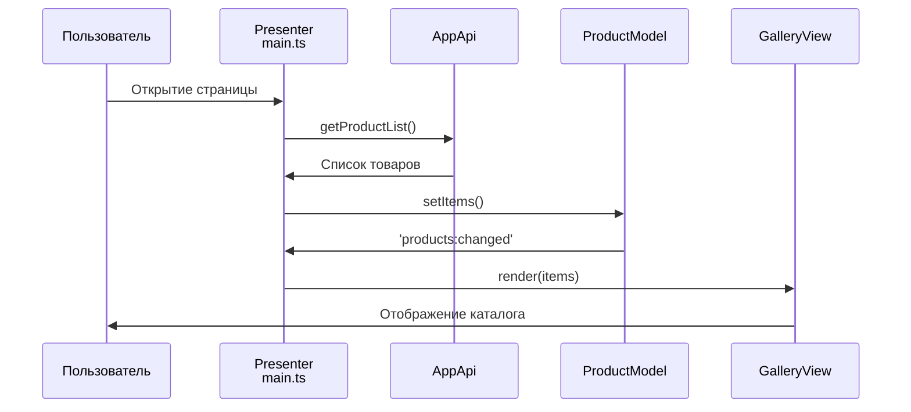
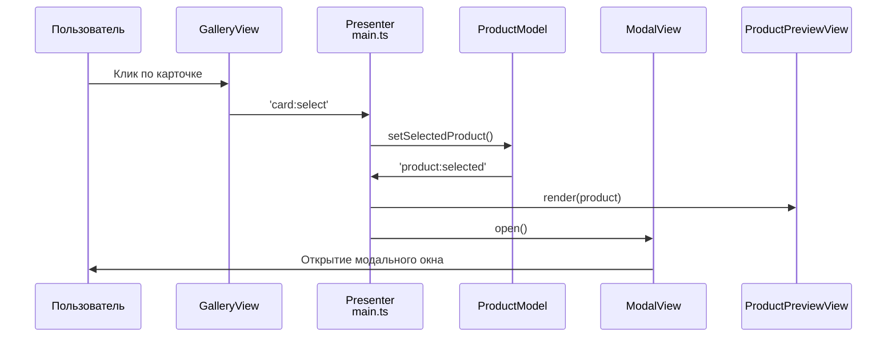
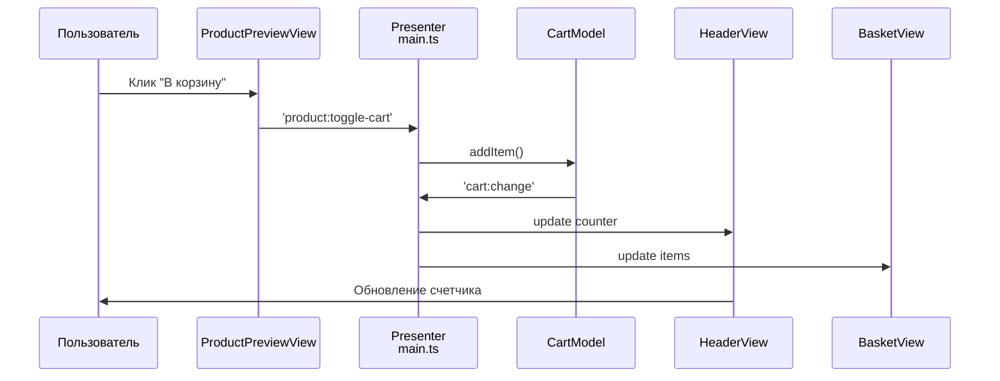
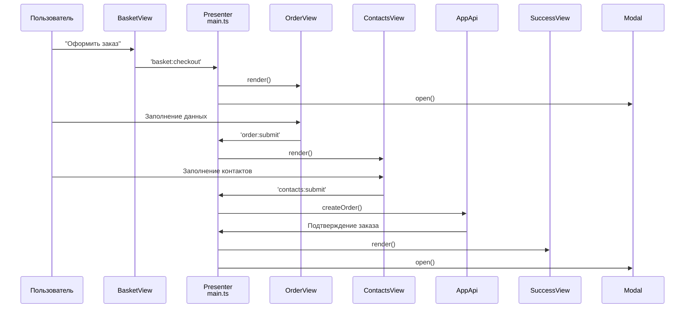

# Проектная работа "Веб-ларек"

**Стек:** HTML, SCSS, TS, Vite

## Структура проекта

```
- src/ — исходные файлы проекта
- src/components/ — папка с JS компонентами
- src/components/base/ — папка с базовым кодом
- src/components/models/ — папка с моделями данных
- src/components/views/ — папка с представлениями
- src/scss/ — папка со стилями
- src/utils/ — папка с утилитами
- src/types/ — папка с типами TypeScript
- src/vendor/ — папка со шрифтами и сторонними библиотеками
- public/ — папка с публичными файлами (иконки, манифест)
```

**Важные файлы:**
- `index.html` — HTML-файл главной страницы
- `src/types/index.ts` — файл с типами
- `src/main.ts` — точка входа приложения
- `src/scss/styles.scss` — корневой файл стилей
- `src/utils/constants.ts` — файл с константами
- `src/utils/utils.ts` — файл с утилитами

## Установка и запуск

Для установки и запуска проекта необходимо выполнить команды:

**npm:**
```bash
npm install
npm run start
```

**yarn:**
```bash
yarn
yarn start
```

## Сборка

**npm:**
```bash
npm run build
```

**yarn:**
```bash
yarn build
```

# Интернет-магазин «Web-Larёk»

«Web-Larёk» — это интернет-магазин с товарами для веб-разработчиков, где пользователи могут просматривать товары, добавлять их в корзину и оформлять заказы. Сайт предоставляет удобный интерфейс с модальными окнами для просмотра деталей товаров, управления корзиной и выбора способа оплаты, обеспечивая полный цикл покупки с отправкой заказов на сервер.

## Архитектура приложения

Код приложения разделен на слои согласно парадигме MVP (Model-View-Presenter), которая обеспечивает четкое разделение ответственности между классами слоев Model и View. Каждый слой несет свой смысл и ответственность:

- **Model** - слой данных, отвечает за хранение и изменение данных
- **View** - слой представления, отвечает за отображение данных на странице  
- **Presenter** - презентер содержит основную логику приложения и отвечает за связь представления и данных

Взаимодействие между классами обеспечивается использованием событийно-ориентированного подхода. Модели и Представления генерируют события при изменении данных или взаимодействии пользователя с приложением, а Презентер обрабатывает эти события используя методы как Моделей, так и Представлений.

### Базовый код

#### Класс Component

Является базовым классом для всех компонентов интерфейса. Класс является дженериком и принимает в переменной `T` тип данных, которые могут быть переданы в метод `render` для отображения.

**Конструктор:**
```typescript
constructor(container: HTMLElement)
```
- принимает ссылку на DOM элемент за отображение, которого он отвечает

**Поля класса:**
- `container: HTMLElement` - поле для хранения корневого DOM элемента компонента

**Методы класса:**
- `render(data?: Partial<T>): HTMLElement` - Главный метод класса. Он принимает данные, которые необходимо отобразить в интерфейсе, записывает эти данные в поля класса и возвращает ссылку на DOM-элемент
- `setText(element: HTMLElement | null, value: string): void` - устанавливает текстовое содержимое элемента
- `setDisabled(element: HTMLElement | null, state: boolean): void` - управляет состоянием disabled элемента
- `setImage(element: HTMLImageElement | null, src: string, alt?: string): void` - утилитарный метод для модификации DOM-элементов ``
- `ensureElement<T extends HTMLElement>(selector: string): T` - вспомогательный метод для безопасного получения элемента

#### Класс Api

Содержит в себе базовую логику отправки запросов.

**Конструктор:**
```typescript
constructor(baseUrl: string, options: RequestInit = {})
```
- В конструктор передается базовый адрес сервера и опциональный объект с заголовками запросов

**Поля класса:**
- `baseUrl: string` - базовый адрес сервера
- `options: RequestInit` - объект с заголовками, которые будут использованы для запросов

**Методы:**
- `get<T extends object>(uri: string): Promise<T>` - выполняет GET запрос на переданный в параметрах ендпоинт и возвращает промис с объектом, которым ответил сервер
- `post<T extends object>(uri: string, data: object, method: ApiPostMethods = 'POST'): Promise<T>` - принимает объект с данными, которые будут переданы в JSON в теле запроса, и отправляет эти данные на ендпоинт переданный как параметр при вызове метода
- `handleResponse<T>(response: Response): Promise<T>` - защищенный метод проверяющий ответ сервера на корректность и возвращающий объект с данными полученный от сервера или отклоненный промис, в случае некорректных данных

#### Класс EventEmitter

Брокер событий реализует паттерн "Наблюдатель", позволяющий отправлять события и подписываться на события, происходящие в системе. Класс используется для связи слоя данных и представления.

**Конструктор класса** не принимает параметров.

**Поля класса:**
- `_events: Map<string | RegExp, Set<Function>>)` - хранит коллекцию подписок на события. Ключи коллекции - названия событий или регулярное выражение, значения - коллекция функций обработчиков, которые будут вызваны при срабатывании события

**Методы класса:**
- `on<T extends object>(event: EventName, callback: (data: T) => void): void` - подписка на событие, принимает название события и функцию обработчик
- `off(eventName: EventName, callback: Subscriber): void` - отписка от события
- `emit<T extends object>(eventName: string, data?: T): void` - инициализация события. При вызове события в метод передается название события и объект с данными, который будет использован как аргумент для вызова обработчика
- `onAll(callback: (event: EmitterEvent) => void): void` - подписка на все события
- `offAll(): void` - сброс всех обработчиков
- `trigger<T extends object>(eventName: string, context?: Partial<T>): (data: T) => void` - возвращает функцию, при вызове которой инициализируется требуемое в параметрах событие с передачей в него данных из второго параметра

## Данные

В приложении используются следующие интерфейсы данных:

### IProduct - интерфейс товара

Описывает данные покупателя, необходимые для оформления заказа. Содержит контактную информацию и способ оплаты.

```typescript
interface IProduct {
  id: string;
  description: string;
  image: string;
  title: string;
  category: string;
  price: number | null;
}
```

### IBuyer - интерфейс покупателя

Описывает данные покупателя, необходимые для оформления заказа. Содержит контактную информацию и способ оплаты.

```typescript
interface IBuyer {
  payment: string; // 'card' или 'cash'
  email: string;
  phone: string;
  address: string;
}
```

### IOrder - интерфейс заказа

Описывает структуру данных для отправки заказа на сервер. Содержит информацию о покупателе, выбранных товарах и общей стоимости.

```typescript
interface IOrder {
  payment: string;
  email: string;
  phone: string;
  address: string;
  total: number;
  items: string[]; // массив id товаров
}
```

## Модели данных

### ProductModel - модель каталога товаров

Отвечает за хранение и управление данными каталога товаров. Сохраняет массив всех товаров и текущий выбранный товар для детального просмотра.

**Конструктор класса:**
```typescript
constructor(private events: IEvents)
```

**Поля класса:**
- `private _items: IProduct[]` - массив всех товаров каталога

**Методы класса:**
- `setItems(items: IProduct[]): void` - сохраняет массив товаров в модель и эмитирует событие 'products:changed'
- `getItems(): IProduct[]` - возвращает массив всех товаров
- `getItem(id: string): IProduct | undefined` - возвращает товар по его идентификатору

### CartModel - модель корзины покупок

Управляет товарами, выбранными пользователем для покупки. Отвечает за добавление, удаление товаров из корзины, подсчет общей стоимости и количества товаров.

**Конструктор класса:**
```typescript
constructor(event: IEvents)
```

**Поля класса:**
- `private _items: IProduct[]` - массив товаров, добавленных в корзину

**Методы класса:**
- `getItems(): IProduct[]` - возвращает массив товаров в корзине
- `addItem(item: IProduct): void` - добавляет товар в корзину и эмитирует событие 'cart:change'
- `removeItem(id: string): void` - удаляет товар из корзины по идентификатору и эмитирует событие 'cart:change'
- `clear(): void` - полностью очищает корзину и эмитирует событие 'cart:change'
- `getTotal(): number` - возвращает общую стоимость всех товаров в корзине
- `getCount(): number` - возвращает количество товаров в корзине
- `hasItem(id: string): boolean` - проверяет наличие товара в корзине по идентификатору

### BuyerModel - модель данных покупателя

Хранит и валидирует данные покупателя, введенные при оформлении заказа. Обеспечивает проверку корректности заполнения полей.

**Конструктор класса** не принимает параметров.

**Поля класса:**
- `private _data: Partial<IBuyer>` - объект с данными покупателя

**Методы класса:**
- `setData(data: Partial<IBuyer>): void` - сохраняет данные покупателя (можно передавать как все поля, так и частично)
- `getData(): Partial<IBuyer>` - возвращает все сохраненные данные покупателя
- `clear(): void` - очищает все данные покупателя
- `validate(): Record<string, string>` - возвращает объект с ошибками валидации (ключ - название поля, значение - текст ошибки)
- `isValid(): boolean` - проверяет, все ли данные покупателя валидны
- `validateFirstStep(): Record<string, string>` - валидация первого шага (оплата и адрес)
- `validateSecondStep(): Record<string, string>` - валидация второго шага (контакты)
- `isFirstStepValid(): boolean` - проверка валидности первого шага
- `isSecondStepValid(): boolean` - проверка валидности второго шага

## Слой коммуникации

### AppApi - класс для работы с API сервера

Обеспечивает взаимодействие приложения с сервером через HTTP-запросы. Использует композицию с базовым классом Api для выполнения запросов.

**Конструктор:**
```typescript
constructor(api: Api) { this.api = api; }
```

**Поля класса:**
- `private api: Api` - экземпляр базового класса Api для выполнения HTTP-запросов

**Методы класса:**
- `getProductList(): Promise<IProduct[]>` - выполняет GET-запрос для получения списка товаров
- `createOrder(order: IOrder): Promise<{ id: string, total: number }>` - выполняет POST-запрос для отправки данных заказа на сервер
- `get baseUrl(): string` - геттер для получения базового URL API

## Визуализация (View)

### ModalView - управление модальными окнами

**Назначение:** Контролирует отображение и скрытие модальных окон, обработку закрытия.

**Поля класса:**
- `closeButton: HTMLButtonElement` - кнопка закрытия модального окна
- `contentElement: HTMLElement` - контейнер для содержимого модального окна

**Методы класса:**
- `open()` - открывает модальное окно, добавляя CSS-класс modal_active
- `close()` - закрывает модальное окно, удаляя CSS-класс и очищая содержимое
- `set content(value: HTMLElement)` - устанавливает содержимое в модальное окно
- `get modalContainer(): HTMLElement` - геттер для доступа к контейнеру модального окна

Обработчики закрытия по клику на крестик, клику вне контента и клавише Escape.

### HeaderView - отображение шапки приложения

**Назначение:** Управляет отображением счетчика товаров в корзине и обработкой клика по корзине.

**Поля класса:**
- `counterElement: HTMLElement` - элемент для отображения количества товаров в корзине
- `basketButton: HTMLElement` - кнопка корзины для открытия модального окна

**Методы класса:**
- `set counter(value: number)` - обновляет отображаемое количество товаров в корзине

Обработчик клика по корзине, эмитирующий событие `'basket:open'`.

### GalleryView - отображение каталога товаров

**Назначение:** Рендерит сетку товаров и обрабатывает выбор товаров для просмотра.

**Поля класса:**
- `productModel: ProductModel` - модель данных товаров для получения информации

**Методы класса:**
- `set items(products: IProduct[])` - отображает массив товаров в виде карточек
- `createProductCard(product: IProduct)` - создает DOM-элемент карточки товара

Обработчик клика по карточке, эмитирующий событие `'card:select'`.

### ProductCardView - базовая карточка товара

**Назначение:** Базовый класс для отображения основных данных товара.

**Поля класса:**
- `titleElement: HTMLElement` - элемент для названия товара
- `priceElement: HTMLElement` - элемент для цены товара

**Методы класса:**
- `set title(value: string)` - устанавливает название товара
- `set price(value: number | null)` - устанавливает цену товара (поддерживает значение "Бесценно")

### ProductPreviewView - детальное превью товара

**Назначение:** Расширенное представление товара с полным описанием и кнопкой действия.

**Поля класса:**
- `descriptionElement: HTMLElement` - элемент для подробного описания товара
- `buttonElement: HTMLButtonElement` - кнопка "В корзину"/"Удалить из корзины"

**Методы класса:**
- `set description(value: string)` - устанавливает описание товара
- `set inBasket(value: boolean)` - меняет текст кнопки в зависимости от состояния корзины
- `setButtonDisabled(state: boolean)` - блокирует/разблокирует кнопку
- `setButtonText(text: string)` - устанавливает произвольный текст кнопки

Обработчик клика по кнопке, эмитирующий событие `'product:toggle-cart'`.

### BasketView - отображение корзины покупок

**Назначение:** Показывает список товаров в корзине, общую стоимость и кнопку оформления.

**Поля класса:**
- `listElement: HTMLElement` - контейнер для списка товаров корзины
- `totalElement: HTMLElement` - элемент для отображения общей стоимости
- `emptyElement: HTMLElement` - элемент сообщения о пустой корзине
- `checkoutButton: HTMLButtonElement` - кнопка перехода к оформлению заказа

**Методы класса:**
- `renderBasket(items: IProduct[], total: number)` - основной метод рендеринга корзины
- `set items(value: HTMLElement[])` - устанавливает список товаров
- `set total(value: number)` - устанавливает общую стоимость
- `set isEmpty(value: boolean)` - управляет видимостью сообщения о пустой корзине

Обработчик клика по кнопке оформления, эмитирующий событие `'basket:checkout'`.

### BasketItemView - элемент товара в корзине

**Назначение:** Отображает отдельный товар в списке корзины с возможностью удаления.

**Поля класса:**
- `indexElement: HTMLElement` - элемент для порядкового номера товара
- `deleteButton: HTMLButtonElement` - кнопка удаления товара из корзины

**Методы класса:**
- `set index(value: number)` - устанавливает порядковый номер товара

Обработчик клика по кнопке удаления, эмитирующий событие `'basket:item-remove'`.

### BaseFormView - базовая форма

**Назначение:** Абстрактный базовый класс для форм с валидацией.

**Поля класса:**
- `submitButton: HTMLButtonElement` - кнопка отправки формы
- `errorsElement: HTMLElement` - элемент для отображения ошибок валидации

**Методы класса:**
- `set valid(value: boolean)` - управляет состоянием кнопки отправки
- `set errors(value: string)` - устанавливает текст ошибок валидации

Обработчик события отправки формы.

### OrderView - форма оформления заказа (шаг 1)

**Назначение:** Форма выбора способа оплаты и ввода адреса доставки.

**Поля класса:**
- `paymentButtons: NodeListOf<HTMLButtonElement>` - кнопки выбора способа оплаты
- `addressInput: HTMLInputElement` - поле ввода адреса доставки

**Методы класса:**
- `set payment(value: string)` - устанавливает выбранный способ оплаты
- `set address(value: string)` - устанавливает значение адреса доставки

Обработчики изменения способа оплаты и ввода адреса.

Эмитирует события `'order:payment-change'` и `'order:address-change'`.

### ContactsView - форма контактных данных (шаг 2)

**Назначение:** Форма ввода email и телефона для завершения оформления заказа.

**Поля класса:**
- `emailInput: HTMLInputElement` - поле ввода email
- `phoneInput: HTMLInputElement` - поле ввода телефона

**Методы класса:**
- `set email(value: string)` - устанавливает значение email
- `set phone(value: string)` - устанавливает значение телефона

Обработчики изменения email и телефона.

Эмитирует события `'contacts:email-change'` и `'contacts:phone-change'`.

### SuccessView - окно успешного оформления заказа

**Назначение:** Отображает подтверждение успешного оформления заказа с суммой списания.

**Поля класса:**
- `closeButton: HTMLButtonElement` - кнопка закрытия окна успеха
- `descriptionElement: HTMLElement` - элемент для отображения суммы списания

**Методы класса:**
- `set total(value: number)` - устанавливает сумму списания в сообщении

Обработчик клика по кнопке закрытия, эмитирующий событие `'success:close'`.

Все классы представлений наследуются от базового класса `Component`, что обеспечивает единообразную работу с DOM-элементами и переиспользование общей логики рендеринга.

## Архитектурная схема приложения



## Детальная схема взаимодействия

### 1. Загрузка и отображение товаров



### 2. Просмотр товаров



### 3. Работа с корзиной



### 4. Оформление заказа



## Основные события приложения


## 📦 События товаров

| Событие | Описание |
|---------|----------|
| `'products:changed'` | Изменен список товаров |
| `'card:select'` | Выбор товара для просмотра |
| `'product:selected'` | Товар выбран для детального просмотра |
| `'product:toggle-cart'` | Добавление/удаление из корзины |

## 🛒 События корзины

| Событие | Описание |
|---------|----------|
| `'cart:change'` | Изменено содержимое корзины |
| `'basket:open'` | Открытие корзины |
| `'basket:item-remove'` | Удаление товара из корзины |
| `'basket:checkout'` | Переход к оформлению заказа |

## 📝 События заказа

| Событие | Описание |
|---------|----------|
| `'order:payment-change'` | Изменение способа оплаты |
| `'order:address-change'` | Изменение адреса доставки |
| `'order:submit'` | Отправка данных заказа (шаг 1) |
| `'contacts:email-change'` | Изменение email покупателя |
| `'contacts:phone-change'` | Изменение телефона покупателя |
| `'contacts:submit'` | Отправка контактных данных (шаг 2) |

## 🎨 События UI

| Событие | Описание |
|---------|----------|
| `'modal:open'` | Открытие модального окна |
| `'modal:close'` | Закрытие модального окна |
| `'buyer:data-change'` | Изменение данных покупателя |
| `'buyer:data-cleared'` | Очистка данных покупателя |